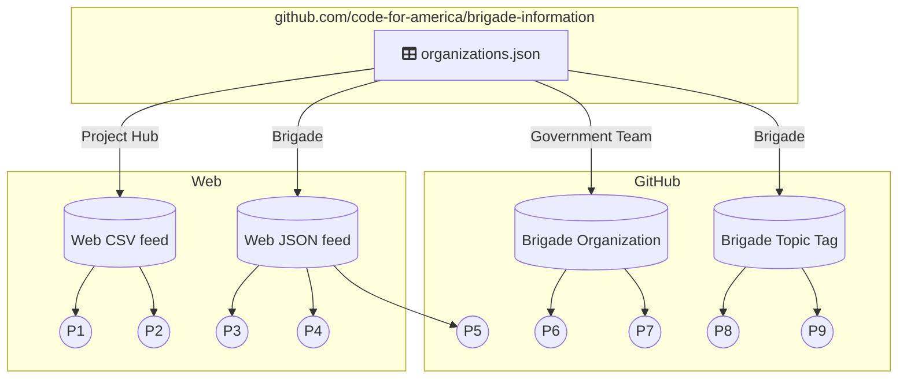

# Project Discovery

All projects in the network index are discovered via an organization that publishes a list of affiliated projects.

## Organizations list

`organizations.json`, hosted in the [`code-for-america/brigade-information`](https://github.com/codeforamerica/brigade-information) repository, is the authoritative list of civic technology organizations included in the network index.

This repository is moderated by Code for America staff, and open for all to update or add to via pull requests. More information about the `organizations.json` format and how to contribute to it can be found in the repository's [`README.md` file](https://github.com/codeforamerica/brigade-information#readme)

Each entry in `organizations.json` represents one brigade or other civic technology organization, and can include a `projects_list_url` declaring where that organization publishes its official list of projects. Several formats are supported, and more could be easily added, so that every organization can participate in the index easily via whatever practice they already use or would like to use to keep stock of projects.

## Projects crawl

From `organizations.json`, the index's crawler goes through every organization's `projects_list_url` to discover projects:



!!! tip
    When organizations publish projects via JSON or CSV web feeds, they can include projects not associated with any GitHub or other source code repository.

    Brigades that document non-code projects can use Google Spreadsheets, static websites, or interactive portals to capture work outside GitHub

## Examples

See [Contributing / Get your organization indexed](../contributing/get-indexed.md) for a complete walkthrough on how to get your organization indexed.

### GitHub organization

BetaNYC's official project list is everything under [the `BetaNYC` GitHub organization](https://github.com/betanyc):

```json
{
    "projects_list_url": "https://github.com/betanyc"
}
```

### GitHub topic

Hack for LA's official project list is everything on GitHub with [the `hack-for-la` topic tag](https://www.github.com/topics/hack-for-la):

```json
{
    "projects_list_url": "https://www.github.com/topics/hack-for-la"
}
```

### Google Spreadsheet

Civic Tech Toronto's official project list is maintained in [a simple Google Spreadsheet](https://docs.google.com/spreadsheets/d/1mqLnB55uVv3d1GPJaaW5XeQ7qdmmKqJZVZyLfD9xL_E/edit):

```json
{
    "projects_list_url": "https://docs.google.com/spreadsheets/d/1mqLnB55uVv3d1GPJaaW5XeQ7qdmmKqJZVZyLfD9xL_E/pub?gid=0&single=true&output=csv"
}
```

### JSON repository list

Chi Hack Night's official project list is a [JSON file](https://raw.github.com/open-city/civic-json-files/master/projects.json) containing a list of only GitHub repository URLs that they publish through [a GitHub repository](https://github.com/chihacknight/civic-json-files):

```json
{
    "projects_list_url": "https://raw.github.com/open-city/civic-json-files/master/projects.json",
}
```

### Dynamic CSV feed

Code for Philly's official project list is a [CSV feed](https://codeforphilly.org/projects.csv) generated from a database by their interactive projects portal:

```json
{
    "projects_list_url": "http://codeforphilly.org/projects.csv"
}
```
